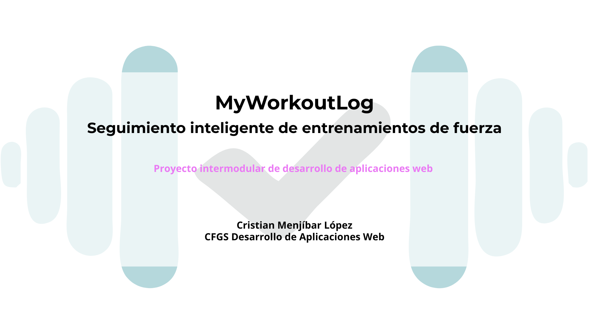

# 👋 Hola, soy Cristian Menjíbar López

Desarrollador web **junior** con **CFGS de Desarrollo de Aplicaciones Web (DAW) finalizado a nivel académico** (pendiente de prácticas **FCT**).  

- 📍 Madrid, España
- 🎓 Nota media del ciclo: **9,6**
- 🔎 Buscando: **Prácticas FCT / Primer puesto junior**
- 💡 Intereses: Arquitectura MVC, Responsive Design, Modelado E-R, POO

---

## 🧰 Tecnologías

**Lenguajes y tecnologías:**

	       

**Bases de datos:**

  

**Sistemas y herramientas:**

           

**Actualmente aprendiendo:**

---

## 📌 Proyectos destacados

## Proyectos destacados
  

  

  <strong>MyWorkoutLog - 2025</strong> 
  Proyecto Final CFGS Desarrollo de Aplicaciones Web (DAW) 
  Aplicación web en PHP con arquitectura MVC propio (Sin frameworks), CRUD básico 
  <a href="https://github.com/menjidev/myworkoutlog_2025" target="_blank">Ver más</a>

 

  

  <strong>Depisana - (2024)</strong> 
  Página web para empresa de depilación láser 
  Página web responsive 
  <a href="https://github.com/menjidev/web_para_depisana_2024" target="_blank">Ver más</a>

## Experiencia

---

## 💼 Experiencia

**Media Power — Prácticas (Desarrollo Web / SEO)**  
Maquetación web con HTML, CSS y JavaScript. Prototipado en Figma.

**PinkStone — Prácticas (Maquetación / SEO)**  
WordPress + Elementor, adaptación de contenidos, usabilidad y optimización SEO On Page.

---

## 📫 Contacto

- 📧 Email: cristianmenjibar@gmail.com
- 💼 LinkedIn: https://linkedin.com/in/cristian-menjibar/
- 🧑‍💻 GitHub: https://github.com/menjidev
- 🌐 Portfolio: https://www.cristianmenjibar.com *(en mantenimiento)*

---

⭐ Si te interesa mi perfil para prácticas o junior, estaré encantado de hablar.

